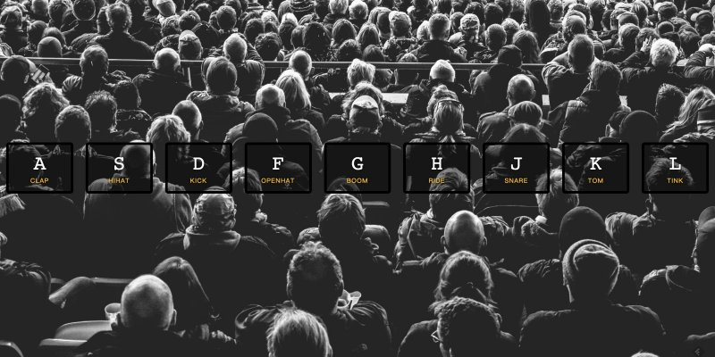

# **01.JavaScript Drum Kit**


## [Demo](https://jamestong10.github.io/Javascript30/01_JavaScript_Drum_Kit/index.html) | [GitHub](https://github.com/jamestong10/Javascript30/tree/master/01_JavaScript_Drum_Kit)

# 主題
使用 js 監聽鍵盤的event，並產生對應的音效

## audio element

attributes: currentTime
設定目前時間，在此用來重設起始時間
methods: play

```
const audio = document.querySelector(`audio[data-key="${e.keyCode}"]`);
audio.currentTime = 0; // rewind to the start
audio.play();
```

## data-* attributes
html 元件可以指定 data-* 的屬性

```
<div data-key="65" class="key">
  <kbd>A</kbd>
  <span class="sound">clap</span>
</div>
```

css selecotr 能使用 data-attributes

```js
const audio = document.querySelector(`audio[data-key="${e.keyCode}"]`);
const key = document.querySelector(`.key[data-key="${e.keyCode}"]`);
```

## String literal
使用**反引號**加 `${var_name}` 就可替字串變數值

## addEventListener
- 替每個 dom element 加上事件監聽器
- dom Arry 要逐筆增加（可以使用 forEach)
- [transitionend](https://developer.mozilla.org/en-US/docs/Web/Events/transitionend) event (第一次看到)

```
const keys = document.querySelectorAll('.key');
keys.forEach(key => key.addEventListener('transitionend', removeTranistion));
```

## classList
使用 classList 增加、刪除 class of dom

```js
this.classList.add('playing');
this.classList.remove('playing');
```