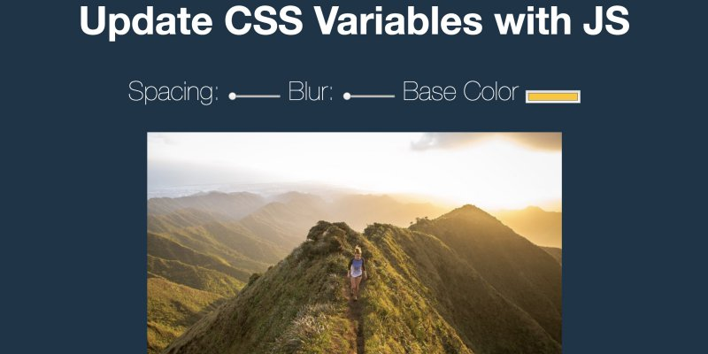

# **03.Playing with CSS Variables and JS**


# 主題
透過 js 控制 css varibales

[Demo](https://jamestong10.github.io/Javascript30/03_Playing_with_CSS_Variables_and_JS/index.html) | [GitHub](https://github.com/jamestong10/Javascript30/tree/master/03_Playing_with_CSS_Variables_and_JS)

# 筆記

## HTML
[input type=range](https://developer.mozilla.org/en-US/docs/Web/HTML/Element/input/range) 產生控制條，可設定預設值、最小/最大值和間距值。
[input type=color](https://developer.mozilla.org/en-US/docs/Web/HTML/Element/input/color) 產生顏色選擇器，可設定預設值。

## CSS
自定義 Css 變數
```css
:root {
  --base: red;
  --spacing: 10px;
  --blur: 10px;
}
```

在css使用自定義變數
```css
img {
  padding: var(--spacing);
  background: var(--base);
  filter: blur(var(--blur));
}
```

## JS
dataset 取得 element 所有 data-attritue

style.setProperty 設定css 變數

```js
function handleUpdate() {
  let suffix = this.dataset.sizing || ''
  document.documentElement.style.setProperty(`--${this.name}`, this.value + suffix);
}
```