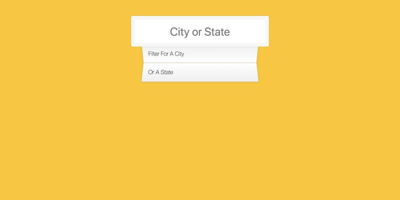

# **06 Ajax Type Ahead**


## [Demo](https://jamestong10.github.io/Javascript30/06_Ajax_Type_Ahead/index.html) | [GitHub](https://github.com/jamestong10/Javascript30/tree/master/06_Ajax_Type_Ahead)

# 主題
使用 fetch 取的資料並即時呈現比對結果

## [Fetch](https://developer.mozilla.org/zh-TW/docs/Web/API/Fetch_API)
fetch 有點像我們所熟悉的 XMLHttpRequest，但新的API提供更強更彈性的功能

fetch 回傳使用[Promise](https://developer.mozilla.org/zh-TW/docs/Web/JavaScript/Reference/Global_Objects/Promise)處理非同步操作

```js
fetch(endpoint)
  .then(blob => blob.json())
  .then(data => cities.push(...data));
```

## **Promise** (很重要)

Promise 物件代表一個即將完成、或失敗的非同步操作，以及它所產生的值

callback 函式的兩個參數：
- `resolve` 是完成的 callback (pending -> resolved)
- `reject` 是失敗的 callback (pending -> rejected)

promise instace 可以使用 `then(onFulfilled, onRejected)` 執行成功與失敗的處理

`onFulfilled` 處理 `resolve` 回傳的結果

`onRejected` 處理 `reject` 回傳的結果

不過實際上不太會寫`onRejected` function 而是使用 `catch(onRejected)` 處理 `reject` 回傳的結果(Error)

```
const promise = new Promise((resolve, reject) => {
  resolve("Success"); // => #then
  reject("Error");  // => #catch
});

promise.then((data)=> {
  console.log(data)
}).catch((err)=> {
  console.log(err)
});
```

### Reference
- [MDN Promise](https://developer.mozilla.org/zh-TW/docs/Web/JavaScript/Reference/Global_Objects/Promise)
- [ES6 Promise](http://es6.ruanyifeng.com/?search=promise&x=0&y=0#docs/promise#Promise-prototype-then)
- [Promise ebook](https://eyesofkids.gitbooks.io/javascript-start-es6-promise/content/contents/intro.html)


## Spread Array

使用`...`可以把array 變成參數序列

```
console.log(1, ...[2, 3, 4], 5)
// 1 2 3 4 5
```

### Reference
- [ES6 Array](http://es6.ruanyifeng.com/#docs/array)

## RegExp

使用正規表達式，找出相同內容的字串

教學使用在 `match()`, `replace()` 可以快速地比對是否有符合表達式的字串

字串要做 regexp 要呼叫 RegExp 物件的建構函式

```
const regex = new RegExp(wordToMatch, 'gi');
```

**Flags**

`g` 表示 global search

`i` 表示 case-insensitive search

也可以使用包含兩個`/`字元表達正規表達式

```js
const re = /(\w+)\s(\w+)/gi;
```
