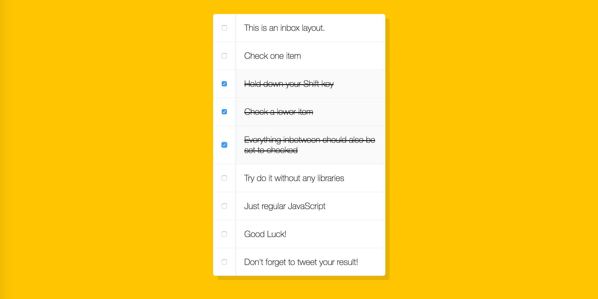

# **10 Hold Shift to Check Multiple Checkboxes**
<!--  -->


## [Demo](https://jamestong10.github.io/Javascript30/10_Hold_Shift_to_Check_Multiple_Checkboxes/index.html) | [GitHub](https://github.com/jamestong10/Javascript30/tree/master/10_Hold_Shift_to_Check_Multiple_Checkboxes)

# 主題
了解 event.shiftKey 使用方法

## event.shiftKey
可以透過 event 取得當前有沒有壓住 shift key
- true - The shift key was pressed
- false - The shift key was not pressed
```
if (e.shiftKey && this.checked) {
   // do sth.
}
```

## boolean flag

使用 boolean 當作 flag，而且在使用`!`小技巧讓 flag 很直覺的切換
```
if (checkbox === this || checkbox === lastchecked) {
  inBetween = !inBetween;
  console.log("starting to check them inbetween.");
}
if (inBetween) {
  checkbox.checked = true;
}
```