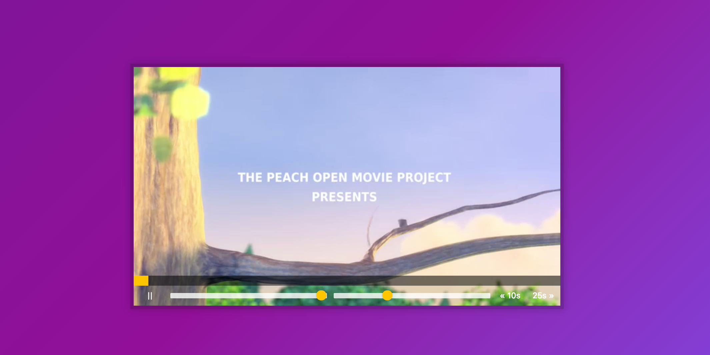

# **11 Custom HTML5 Video Player**
<!--  -->


## [Demo](https://jamestong10.github.io/Javascript30/11_Custom_HTML5_Video_Player/index.html) | [GitHub](https://github.com/jamestong10/Javascript30/tree/master/11_Custom_HTML5_Video_Player)

# 主題

了解 HTML5 Video Element

## document#querySelector

使用 #querySelector 取得的dom，可以再使用 #querySelector

## Video element

video properties and methods

```
video.paused       // 是否暫停播放 boolean
video.currentTime  // 目前影片時間
video.duration     // 影片總時間
video.volume       // 音量
video.playbackRate // 播放速度
video.play()       // 播放
video.pause()      // 暫停
```

skip 使用 data-attribute 的方法取得時間

這樣的設計很直接也很好調整

```
<button data-skip="-10" class="player__button">« 10s</button>

function skip() {
  video.currentTime += parseFloat(this.dataset.skip);
}
```

音量和播放速度搭配`input type='range'`可設定value
```
function handleRangeUpdate() {
  video[this.name] = this.value;
}
```

## 善用 Event listener

其中有的條件是要持續更新影片的進度條，當下想到是使用 setInterval

但作者使用 timeupdate event 很快速又直覺達到目標

```
video.addEventListener('timeupdate', handleProcess);
```

## 更新時間進度條

作者提供不錯的方法，快速建立和更新進度條

進度條使用`flex-basis`的屬性，即可產生進度條的效果

```
.progress__filled {
  width:50%;
  background:#ffc600;
  flex:0;
  flex-basis:2%;
}
```

使用`offsetX / offsetWidth`取得x軸位移的比例，再乘上影片時間，即可得到時間進度條


```
function handleProcess() {
  const percent = (video.currentTime / video.duration) * 100;
  progressBar.style.flexBasis = `${percent}%`;
}
```

