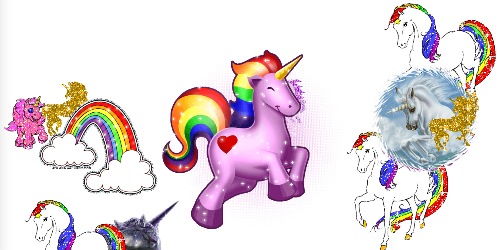

# **12 Key Sequence Detection**
<!--  -->


## [Demo](https://jamestong10.github.io/Javascript30/12_Key_Sequence_Detection/index.html) | [GitHub](https://github.com/jamestong10/Javascript30/tree/master/12_Key_Sequence_Detection)

# 主題
依序記錄鍵盤輸入的內容

## Window object

所有瀏覽器都支持window 對象。它表示瀏覽器窗口。

所有JavaScript 全局對象、函數以及變量均自動成為window 對象的成員。

全局變量是window 對象的屬性。

全局函數是window 對象的方法。

document 也是window 對象的屬性之一

```
window.addEventListener("keyup", (e) => {});
```

## Array#splice

可以藉由刪除既有元素並／或加入新元素來改變一個陣列的內容

語法

```
array.splice(start[, deleteCount[, item1[, item2[, ...]]]])
```

開始位置為負號表示從最後面開始計算

作者展示小技巧，透過負號設定到陣列初始位置，刪除超過密碼文字的長度，因此陣列始終保持固定長度

```
pressed.splice(-pressed.length - 1, pressed.length - secretCode.length);
```

## String#includes

檢查字串中是否有符合相同字串並會傳Boolean

```
pressed.join('').includes(secretCode)
```

## Cornify.js

產生獨角獸和彩虹的小工具，散播閃亮幸福到全世界

在畫面加入獨角獸和彩虹

```
cornify_add();
```