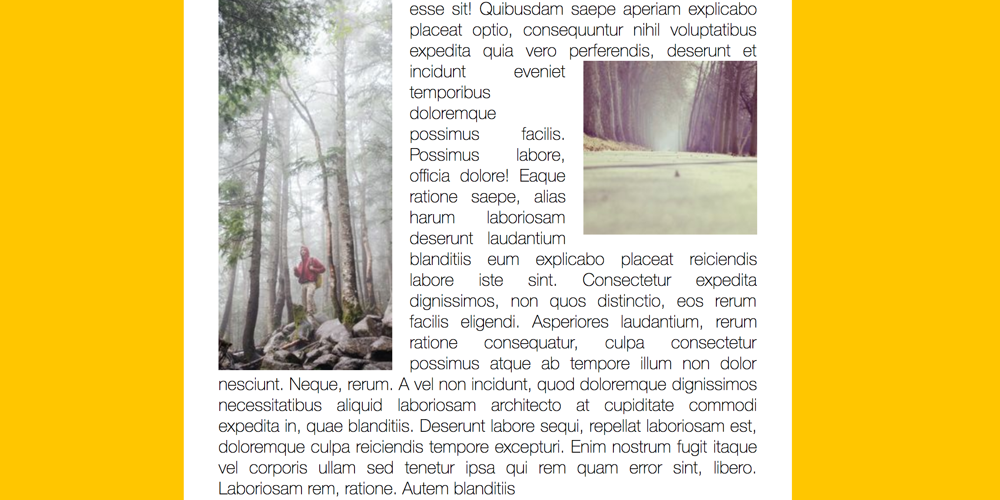

# **13 Slide In on Scroll**
<!--  -->


## [Demo](https://jamestong10.github.io/Javascript30/13_Slide_In_on_Scroll/index.html) | [GitHub](https://github.com/jamestong10/Javascript30/tree/master/13_Slide_In_on_Scroll)

# 主題

產生動態淡入的圖片效果

## 使用translate 產生移動效果

使用X位移將圖片移除可瀏覽位置

```
.align-left.slide-in {
  transform: translateX(-30%) scale(0.95);
}

.align-right.slide-in {
  transform: translateX(30%) scale(0.95);
}
```

把X位移設為0%圖片就會回到原本的位置

```
.slide-in.active {
  opacity: 1;
  transform: translateX(0%) scale(1);
}
```

使用opacity, transition 產生淡出淡入效果

```
.slide-in {
  opacity: 0;
  transition: all .5s;
}
```

將 opacity 從0變1產生淡出效果

```
.slide-in.active {
  opacity: 1;
  transform: translateX(0%) scale(1);
}
```

## scroll event

監聽使用者scroll事件，在加入debounce函式，減少事件大量觸發

debounce：設定多少時間在執行一次傳入函式，避免重複觸發

```
window.addEventListener('scroll', debounce(checkSlide));
```

## Window attributes

window.scrollY 網頁頂端到目前位置(頁面頂端)Y軸位移的距離

```
pageYOffset == window.scrollY // true
```

window.innerHeight 目前頁面的高度

```
window.innerHeight
```

dom_object.offsetTop 目前物件的上邊框與該父物件上邊框的距離
dom_object.offsetLeft 目前物件的左邊框與該父物件左邊框的距離

兩者皆從 border 開始計算不包含boder width

```
sliderImage.offsetTop
```
