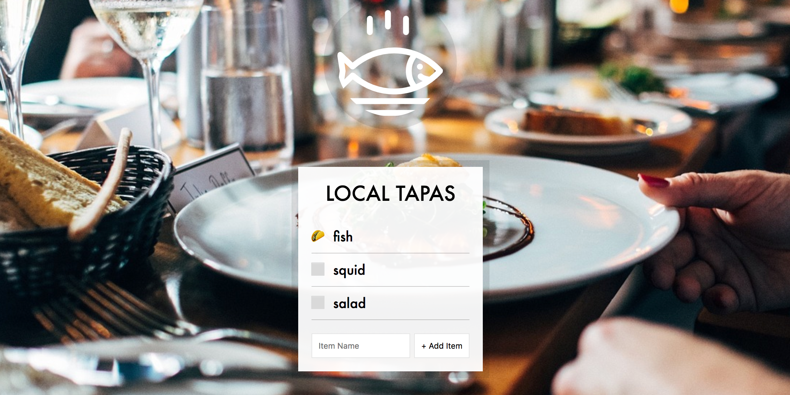

# **15 LocalStorage and Event Delegation**
<!--  -->


## [Demo](https://jamestong10.github.io/Javascript30/15_LocalStorage_and_Event_Delegation/index.html) | [GitHub](https://github.com/jamestong10/Javascript30/tree/master/15_LocalStorage_and_Event_Delegation)

# 主題

建立點菜清單

## EventListener

在 function 內`this`表示是event dom

可以使用 `querySelector` 取得 dome object

作者表示這樣使用的好處，操作上叫直觀，範圍也直接縮小

```
function addItem(e) {
  const text = (this.querySelector('[name=item]')).value;
}
```

## Event#preventDefault

取消此事件預設要執行的動作

作者用來取消原本會執行from submit

```
function addItem(e) {
  e.preventDefault();
}
```

## Event delegate

作者有示範在每個 checkbox 加上 event listener，但新增 item 就要重新加上listener 非常不直覺

這時可以使用 event delegate 是基於 event binding 上的一種技巧

利用 Event 向父元素傳遞的特性（Bubble Event)，如果遇到動態物件變更，就把事件註冊到這些元素的父元素，就可以解決問題，又可以減少程式碼的複雜度

```
itemsList.addEventListener('click', toggleDone);
```

雖然使用 event delegate 處理掉問題，但也會觸發多次event，例如：點label 同時觸發 checkbox

可以使用 `#matches` 排除不需要的事件

```
function toggleDone(e) {
if (!e.target.matches('input')) return;
}
```

## localStorage

儲存在本地端資料，使用URL 區分，以key, value 方式儲存(key, value 皆為 string)

使用四個API 存取localStorage
`#setItem`, `#getItem`, `#removeItem`, `#clear`

```
const items = JSON.parse(localStorage.getItem('items')) || [];

function addItem(e) {
  // skip...
  localStorage.setItem('items', JSON.stringify(items));
}
```