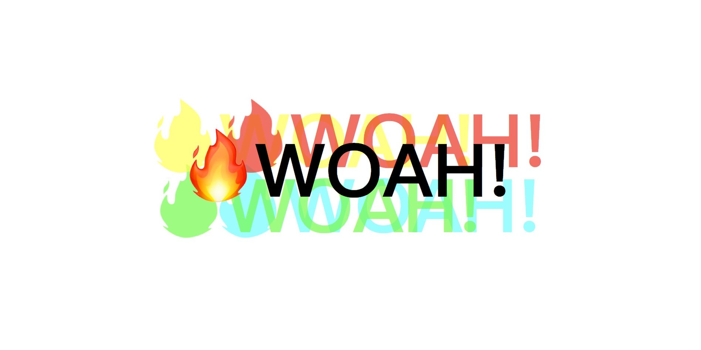

# **16 Mouse Move Shadow**
<!--  -->


## [Demo][016Demo] | [GitHub][016Js]
[016Demo]:https://jamestong10.github.io/Javascript30/16_Mouse_Move_Shadow/index.html
[016Js]:https://github.com/jamestong10/Javascript30/tree/master/16_Mouse_Move_Shadow

# 主題

滑鼠移動時產生動態文字陰影

## Destructuring assignment

ES6 特性

```
const { offsetWidth: width, offsetHeight: height } = hero
let { offsetX: x, offsetY: y } = e;
```

## EventListener

mousemove 特性當滑鼠移動到子元件 `offsetX`, `offsetY` 是子原件的座標

因此會產生座標不連續的情況

作者檢查兩者是否為相同物件使座標連續

```
if (this != e.target) {
  x += e.target.offsetLeft;
  y += e.target.offsetTop;
}
```

## TextShadow

產生文字陰影

textshadow: offset-x | offset-y | blur-radius | color

```
text.style.textShadow = `
  ${xWalk}px ${yWalk}px 0 rgba(255,0,0,0.7),
  ${xWalk * -1}px ${yWalk}px 0 rgba(255,255,0,0.7),
  ${yWalk}px ${xWalk}px 0 rgba(0,255,0,0.7),
  ${yWalk * -1}px ${xWalk}px 0 rgba(0,255,255,0.7)
`;
```