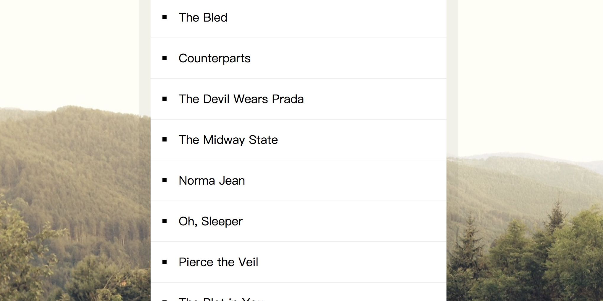

# **17 Sorting Band Names without articles**
<!--  -->

## [Demo][017Demo] | [GitHub][017Js]

[017Demo]:https://jamestong10.github.io/Javascript30/17_Sorting_Band_Names_without_articles/index.html
[017Js]:https://github.com/jamestong10/Javascript30/tree/master/17_Sorting_Band_Names_without_articles

# 主題

排除冠詞的名稱排序

## Array#sort

使用`sort`排序，兩者比大小，大回傳1，小回傳-1

```
const sortedBands = bands.sort((a, b) => (strip(a) > strip(b)) ? 1 : -1);
```

## String#replace

使用 regex 取代文字

regex: `/^(a|the|an)/i` 表示檢查文字開頭是否有符合 a, an, the 等字(不分大小寫)) 

```
function strip(bandName) {
  return bandName.replace(/^(a|the|an)/i, '').trim();
}
```

## Array#map

對array 內元素加工並回傳新陣列

```
sortedBands.map(band => `<li>${band}</li>`).join('');
```
