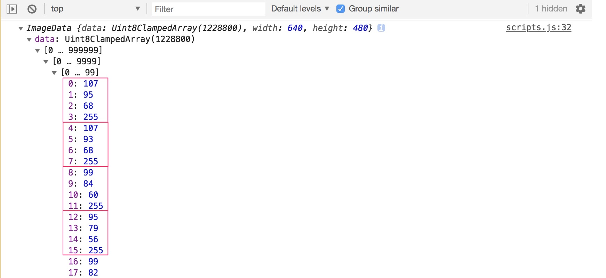

# **19 Unreal Webcam Fun**

<!--  -->

## [Demo][019Demo] | [GitHub][019Js]

[019Demo]:https://jamestong10.github.io/Javascript30/18_Tally_String_Times_with_Reduce/index.html
[019Js]:https://github.com/jamestong10/Javascript30/tree/master/19_Unreal_Webcam_Fun

# 主題

使用電腦鏡頭，拍照、修圖樣樣來

## mediaDevices#getUserMedia

會提示用戶給予使用媒體輸入的許可，媒體輸入會產生一個`MediaStream`，裡面包含了請求的媒體類型的軌道

此流可以包含一個視頻軌道（來自硬件或者虛擬視頻源，比如相機、視頻採集設備和屏幕共享服務等等）、一個音頻軌道（同樣來自硬件或虛擬音頻源，比如麥克風、A/D轉換器等等），也可能是其它軌道類型。

它返回一個`Promise` 對象，成功後會`resolve` 回調一個`MediaStream` 對象。若用戶拒絕了使用權限，或者需要的媒體源不可用，`promise` 會`reject` 回調一個`PermissionDeniedError` 或者`NotFoundError`。

```
navigator.mediaDevices.getUserMedia({ video: true, audio: false })
    .then(stream => {
      //...
    })
    .catch(err => {
      console.err(`oh no`, err);
    });
```

## URL#createObjectURL

建立一個帶有URL的 DOMString 以代表參數中所傳入的物件. 該URL的生命週期與創造它的window中的 document一致. 這個新的物件URL 代表了所指定的 File 物件 或是 Blob 物件.

作者使用此方法將視訊頻道顯示在頁面

```
video.src = window.URL.createObjectURL(localMediaStream);
```

## 讓 canvas 產生有視訊的效果

使用 #drawImage 將video 內容呈現在 canvas

```
setInterval(() => {
    ctx.drawImage(video, 0, 0, width, height);
  }, 16);
```

## 產生圖片

作者設計拍照按鈕，點選按鈕會有拍照聲並且顯示照片

使用`canvas#toDataURL` 產生圖片，預設是`image/png`，作者使用`images/jpeg`

```
function takePhoto() {
  // play the sound
  snap.currentTime = 0;
  snap.play();

  // take the data out of the canvas
  const data = canvas.toDataURL('image/jpeg');
  const link = document.createElement('a');
  // console.log(data);
  link.href = data;
  link.setAttribute('download', 'handsome');
  // link.textContent = 'downlaod';
  link.innerHTML = ``
  strip.insertBefore(link, strip.firstChild);
}
```

## 改變圖片

作者說明圖片直接印出，只會看到一連串的文字，透過`#getImageData` 可取得rgba所組成的陣列



圖片顯示每個pixel 為陣列中每4個元素即代表Red, Green, Blue, Alpha

因此要改變圖片，就需要針對內容 0~255 做調整囉

```
let pixels = ctx.getImageData(0, 0, width, height);
console.log(pixels) // image data

// mess with them
pixels = redEffect(pixels);

// put them back
ctx.putImageData(pixels, 0, 0);
```