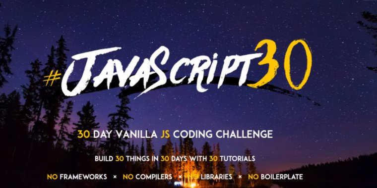

# Javascript30
跟著 WesBos 一起挑戰 JavaScript30

* [Wesbos JavaScript30 github](https://github.com/wesbos/JavaScript30)
* [挑戰 javascript30](https://javascript30.com/)

## 先註冊才能進入課程

# List
| Day | Challenge | Demo | Github |
|-----|-----------|------|--------|
| 01 | JavaScript Drum Kit | [Demo](https://jamestong10.github.io/Javascript30/01_JavaScript_Drum_Kit/index.html) | [Javascript](https://github.com/jamestong10/Javascript30/tree/master/01_JavaScript_Drum_Kit)
| 02 | CSS and JS Clock | [Demo](https://jamestong10.github.io/Javascript30/02_CSS_and_JS_Clock/index.html) | [Javascript](https://github.com/jamestong10/Javascript30/tree/master/02_CSS_and_JS_Clock)
| 03 | CSS Variables | [Demo](https://jamestong10.github.io/Javascript30/03_Playing_with_CSS_Variables_and_JS/index.html) | [Javascript](https://github.com/jamestong10/Javascript30/tree/master/03_Playing_with_CSS_Variables_and_JS) |
| 04 | Array Cardio Day 1 | [Demo](https://jamestong10.github.io/Javascript30/04_Array_Cardio_Day_1/index.html) | [Javascript](https://github.com/jamestong10/Javascript30/tree/master/04_Array_Cardio_Day_1) |
| 05 | Flex Panel Gallery | [Demo](https://jamestong10.github.io/Javascript30/05_Flex_Panels_Image_Gallery/index.html) | [Javascript](https://github.com/jamestong10/Javascript30/tree/master/05_Flex_Panels_Image_Gallery) |
| 06 | Type Ahead | [Demo](https://jamestong10.github.io/Javascript30/06_Ajax_Type_Ahead/index.html) | [Javascript](https://github.com/jamestong10/Javascript30/tree/master/06_Ajax_Type_Ahead) |
| 07 | Array Cardio Day 2 | [Demo](https://jamestong10.github.io/Javascript30/07_Array_Cardio_Day_2/index.html) | [Javascript](https://github.com/jamestong10/Javascript30/tree/master/07_Array_Cardio_Day_2) |
| 08 | Fun with HTML5 Canvas | [Demo](https://jamestong10.github.io/Javascript30/08_Fun_with_HTML5_Canvas/index.html) | [Javascript](https://github.com/jamestong10/Javascript30/tree/master/08_Fun_with_HTML5_Canvas) |
| 09 | Dev Tools Domination | [Demo](https://jamestong10.github.io/Javascript30/PROJECT/index.html) | [Javascript](https://github.com/jamestong10/Javascript30/tree/master/PROJECT) |
| 10 | Hold Shift and Check Checkboxes | [Demo](https://jamestong10.github.io/Javascript30/PROJECT/index.html) | [Javascript](https://github.com/jamestong10/Javascript30/tree/master/PROJECT) |
| 11 | Custom Video Player | [Demo](https://jamestong10.github.io/Javascript30/PROJECT/index.html) | [Javascript](https://github.com/jamestong10/Javascript30/tree/master/PROJECT) |
| 12 | Key Sequence Detection | [Demo](https://jamestong10.github.io/Javascript30/PROJECT/index.html) | [Javascript](https://github.com/jamestong10/Javascript30/tree/master/PROJECT)    |
| 13 | Slide in on Scroll | [Demo](https://jamestong10.github.io/Javascript30/PROJECT/index.html) | [Javascript](https://github.com/jamestong10/Javascript30/tree/master/PROJECT) |
| 14 | JavaScript References VS Copying | [Demo](https://jamestong10.github.io/Javascript30/PROJECT/index.html) | [Javascript](https://github.com/jamestong10/Javascript30/tree/master/PROJECT) |
| 15 | LocalStorage | [Demo](https://jamestong10.github.io/Javascript30/PROJECT/index.html) | [Javascript](https://github.com/jamestong10/Javascript30/tree/master/PROJECT) |
| 16 | Mouse Move Shadow | [Demo](https://jamestong10.github.io/Javascript30/PROJECT/index.html) | [Javascript](https://github.com/jamestong10/Javascript30/tree/master/PROJECT) |
| 17 | Sort Without Articles | [Demo](https://jamestong10.github.io/Javascript30/PROJECT/index.html) | [Javascript](https://github.com/jamestong10/Javascript30/tree/master/PROJECT) |
| 18 | Adding Up Times with Reduce | [Demo](https://jamestong10.github.io/Javascript30/PROJECT/index.html) | [Javascript](https://github.com/jamestong10/Javascript30/tree/master/PROJECT) |
| 19 | Webcam Fun | [Demo](https://jamestong10.github.io/Javascript30/PROJECT/index.html) | [Javascript](https://github.com/jamestong10/Javascript30/tree/master/PROJECT) |
| 20 | Speech Detection | [Demo](https://jamestong10.github.io/Javascript30/PROJECT/index.html) | [Javascript](https://github.com/jamestong10/Javascript30/tree/master/PROJECT) |
| 21 | Geolocation | [Demo](https://jamestong10.github.io/Javascript30/PROJECT/index.html) | [Javascript](https://github.com/jamestong10/Javascript30/tree/master/PROJECT)  |
| 22 | Follow Along Link Highlighter | [Demo](https://jamestong10.github.io/Javascript30/PROJECT/index.html) | [Javascript](https://github.com/jamestong10/Javascript30/tree/master/PROJECT) |
| 23 | Speech Synthesis | [Demo](https://jamestong10.github.io/Javascript30/PROJECT/index.html) | [Javascript](https://github.com/jamestong10/Javascript30/tree/master/PROJECT) |
| 24 | Sticky Nav | [Demo](https://jamestong10.github.io/Javascript30/PROJECT/index.html) | [Javascript](https://github.com/jamestong10/Javascript30/tree/master/PROJECT) |
| 25 | Event Capture, Propagation, Bubbling and Once | [Demo](https://jamestong10.github.io/Javascript30/PROJECT/index.html) | [Javascript](https://github.com/jamestong10/Javascript30/tree/master/PROJECT) |
| 26 | Stripe Follow Along Nav | [Demo](https://jamestong10.github.io/Javascript30/PROJECT/index.html) | [Javascript](http://github.com/jamestong10/Javascript30/tree/master/PROJECT) |
| 27 | Click and Drag | [Demo](https://jamestong10.github.io/Javascript30/PROJECT/index.html) | [Javascript](http://github.com/jamestong10/Javascript30/tree/master/PROJECT) |
| 28 | Video Speed Controller | [Demo](https://jamestong10.github.io/Javascript30/PROJECT/index.html) | [Javascript](http://github.com/jamestong10/Javascript30/tree/master/PROJECT) |
| 29 | Countdown Timer | [Demo](https://jamestong10.github.io/Javascript30/PROJECT/index.html) | [Javascript](http://github.com/jamestong10/Javascript30/tree/master/PROJECT) |
| 30 | Whack A Mole  | [Demo](https://jamestong10.github.io/Javascript30/PROJECT/index.html) | [Javascript](http://github.com/jamestong10/Javascript30/tree/master/PROJECT) |